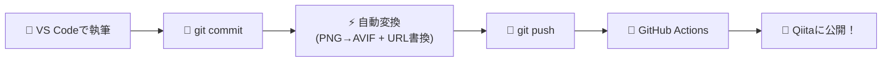
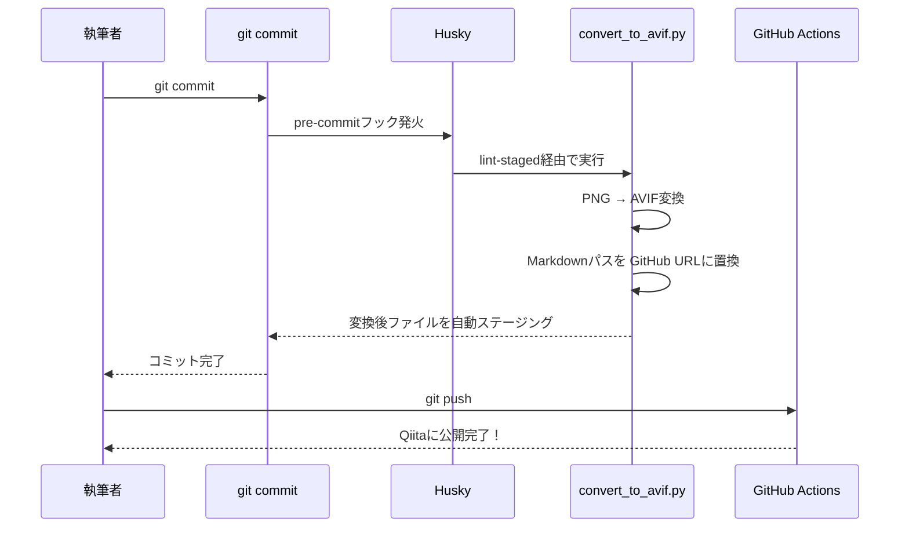

> Qiita CLIとGitHub Actionsを活用し、VS Codeだけで記事管理・画像最適化・公開を完結させる環境を紹介します。

## はじめに：筆者の5つの欲求

技術ブログ、書いてますか？

筆者はブログを書くたびに、地味なストレスを感じていました。ブラウザのエディタで書くと、途中でタブを切り替えたりして集中が途切れる。画像を入れようとするとパスの管理が面倒。手元ではきれいに見えていたのに、いざ公開すると画像がリンク切れ……。

そこで、こんな環境があったらいいな、というワガママを5つ書き出してみました。

1. **VS Codeなどの好きなエディタで、Qiita記事を一元管理したい**
2. **画像は軽くてきれいな次世代フォーマット（AVIF）を使いたい**
3. **コマンド一発で記事をアップロードして、エディタ上ですべて完結させたい**
4. **お金をかけずに実現したい**（全部無料で済むこと）
5. **APIトークンなどのセキュリティも安心して運用したい**

「全部叶えるのはさすがに欲張りすぎじゃない？」と思いますよね。
でも、できちゃったんです。

## こんなものを作ってみました

結論から見せます。完成した環境では、執筆体験がこうなります。



**やることは、書いて、コミットして、プッシュするだけ。**

コミットした瞬間に、裏側でこんなことが自動的に起きます。

- 手元のPNG画像が、軽量なAVIFフォーマットに一括変換される
- Markdown内の `images/xxx.png` というローカルパスが、GitHub上の公開用URLに書き換わる
- 変換後のファイルがコミットに自動で含まれる

あとは `git push` するだけで、GitHub Actionsが記事をQiitaにアップロードしてくれます。

実際にこの仕組みの中で `git commit` を叩くと、ターミナルにはこんな出力が表示されます。

```
⋯ Running tasks for staged files…
    public/*.md — 1 file
      ⋯ .venv/Scripts/python.exe scripts/convert_to_avif.py

✔ .venv/Scripts/python.exe scripts/convert_to_avif.py

✔ Done running tasks for staged files!
[main xxxxxxx] feat: 新しい記事を追加
```

人間が意識するのは「記事を書くこと」だけ。面倒な作業は全部、仕組みに任せてしまえる環境です。

:::note info
この環境をすぐに試したい方のために、テンプレートリポジトリを用意しています。
フォークしてクローンすれば、以下の手順をスキップしてすぐに使い始められます。
🔗 **[qiita-blog-template（GitHub）](https://github.com/tademushi2004/qiita-blog-template)**
:::

---

## 第1章：環境構築【基礎編】── Qiita CLIで記事をGit管理する

この章では、冒頭で挙げた欲求のうち ①③④⑤ を叶えます。ブラウザを開かず、ターミナルとエディタだけで記事の管理と公開ができる環境を構築していきましょう。

### 前提条件

以下のツールが必要です。すべて **無料** で利用できます。

| ツール | 用途 | 確認コマンド |
|--------|------|-------------|
| [Node.js](https://nodejs.org/) (v18以上) | Qiita CLIの実行環境 | `node -v` |
| [Git](https://git-scm.com/) | バージョン管理 | `git -v` |
| [VS Code](https://code.visualstudio.com/) | エディタ（お好みでOK） | — |
| GitHubアカウント | リポジトリ管理、GitHub Actions | — |
| Qiitaアカウント | 記事の投稿先 | — |

:::note info
GitHub Actionsは、パブリックリポジトリであれば **完全無料・利用無制限** です。プライベートリポジトリでも月2,000分まで無料で使えますが、記事公開の処理は数十秒で終わるため、無料枠を使い切る心配はまずありません。
:::

### ステップ1：Qiita CLIのセットアップ

まず、プロジェクト用のフォルダを作成し、Qiita CLIをインストールします。

```bash
mkdir my-qiita-blog
cd my-qiita-blog
npm init -y
npm install @qiita/qiita-cli --save-dev
```

次に、QiitaのAPIトークンを取得します。

1. Qiitaにログインし、[設定 → アプリケーション](https://qiita.com/settings/applications) にアクセス
2. 「個人用アクセストークン」の「新しくトークンを発行する」をクリック
3. スコープは **`read_qiita`** と **`write_qiita`** にチェックを入れて発行
4. 表示されたトークンを **安全な場所にコピー** しておく（二度と表示されません）

トークンを使ってログインします。

```bash
npx qiita login
```

プロンプトが表示されたら、先ほどコピーしたトークンを貼り付けてください。

### ステップ2：GitHubリポジトリの作成と連携

GitHubで新しいリポジトリを作成し、ローカルと連携させます。

```bash
git init
git remote add origin https://github.com/あなたのユーザー名/my-qiita-blog.git
```

### ステップ3：GitHub Actionsワークフローの設定

`git push` をトリガーにしてQiitaへ自動公開するためのワークフローファイルを作成します。

```bash
mkdir -p .github/workflows
```

`.github/workflows/publish.yml` を以下の内容で作成してください。

```yaml
name: Publish articles

on:
  push:
    branches:
      - main
    paths:
      - "public/**"
      - "qiita.config.json"
  workflow_dispatch:

permissions:
  contents: write

concurrency:
  group: ${{ github.workflow }}-${{ github.ref }}
  cancel-in-progress: false

jobs:
  publish_articles:
    runs-on: ubuntu-latest
    timeout-minutes: 5
    if: github.event.head_commit.author.name != 'github-actions[bot]'
    steps:
      - uses: actions/checkout@v4
        with:
          fetch-depth: 0
      - uses: increments/qiita-cli/actions/publish@v1
        with:
          qiita-token: ${{ secrets.QIITA_TOKEN }}
          root: "."
```

:::note warn
**セキュリティについて**: APIトークンは **絶対にソースコードに直接書かないでください**。代わりに、GitHubの「Repository Secrets」に登録して安全に管理します。
:::

### ステップ4：GitHub SecretsにAPIトークンを登録する

1. GitHubのリポジトリページを開く
2. **Settings** → **Secrets and variables** → **Actions** に移動
3. **New repository secret** をクリック
4. Name: `QIITA_TOKEN`、Secret: 先ほどコピーしたQiitaのAPIトークンを貼り付け
5. **Add secret** をクリック

これで、ワークフローファイルの `${{ secrets.QIITA_TOKEN }}` がGitHub上で安全に展開されるようになります。トークンはGitHub上で暗号化されて保存されるため、リポジトリをパブリックにしても外部から読み取られることはありません。

### ステップ5：記事の作成方法

記事を安全に作成するために、ヘルパースクリプトを用意しましょう。以下の内容で `scripts/new_article.js` を作成してください。

<details><summary>scripts/new_article.js（クリックで展開）</summary>

```javascript
const { execSync } = require('child_process');
const fs = require('fs');
const path = require('path');

const title = process.argv[2];

if (!title) {
  console.error('Usage: npm run new "Article Title"');
  process.exit(1);
}

try {
  console.log(`Creating new article: "${title}"...`);
  const stdout = execSync(`npx qiita new "${title}"`, { encoding: 'utf-8' });
  console.log(stdout);

  const publicDir = path.join(__dirname, '..', 'public');
  const files = fs.readdirSync(publicDir)
    .filter(f => f.endsWith('.md'))
    .map(f => ({
      name: f,
      time: fs.statSync(path.join(publicDir, f)).mtime.getTime()
    }))
    .sort((a, b) => b.time - a.time);

  if (files.length > 0) {
    const newestFile = path.join(publicDir, files[0].name);
    let content = fs.readFileSync(newestFile, 'utf-8');
    
    if (content.includes('private: false')) {
      content = content.replace('private: false', 'private: true');
    }
    if (content.includes("tags:\n  - ''")) {
      content = content.replace("tags:\n  - ''", "tags:\n  - 'Draft'");
    }

    fs.writeFileSync(newestFile, content, 'utf-8');
    console.log(`✅ Successfully configured ${files[0].name} (private: true, tags: Draft)`);
  }
} catch (error) {
  console.error('Error creating article:', error.message);
  process.exit(1);
}
```

</details>

次に、`package.json` の `scripts` に以下を追加します。

```json
{
  "scripts": {
    "new": "node scripts/new_article.js"
  }
}
```

これで、以下のコマンドで新しい記事を作成できるようになります。

```bash
npm run new "はじめてのQiita記事"
```

このコマンドで記事を作ると、自動的に `private: true`（限定共有）とデフォルトタグ（`Draft`）が設定されます。**書きかけの記事がうっかり全世界に公開されてしまう事故を、仕組みで防ぐ**わけです。

### ✅ 動作確認チェックポイント

ここまでの設定が正しくできているか、実際に確認してみましょう。

```bash
npm run new "テスト記事"
git add .
git commit -m "test: 初回テスト"
git push origin main
```

数分後、Qiitaの [マイページ → 記事の管理 → 限定共有](https://qiita.com/mine/articles?type=private) を確認してみてください。「テスト記事」が限定共有として公開されていれば成功です！🎉


---

## 第2章：環境構築【応用編】── Huskyで画像の全自動変換を追加する

この章では、冒頭で掲げた欲求の2つ目── **「画像は軽くてきれいなAVIFを使いたい」** ──を叶えます。コミットした瞬間に、画像の最適化とMarkdownの書き換えが全自動で走る仕組みを追加しましょう。

### なぜ画像の自動化が必要なのか？

第1章の環境だけでも記事の管理と公開はできますが、画像を使い始めると2つの問題にぶつかります。

- **プレビューと公開のジレンマ**: Markdown内で `images/photo.png` と書けばVS Codeでプレビューできるが、Qiitaにはその画像が存在しないため表示されない。かといってURLで書くとローカルでプレビューできない。
- **リポジトリの肥大化**: 高画質なPNGをそのまま何枚もコミットすると、Gitリポジトリが数百MBに膨れ上がる。

これを解決するのが **AVIF**（AV1 Image File Format）です。次世代の画像フォーマットで、**PNGと比べてファイルサイズを60〜80%削減** できるにもかかわらず高い画質を維持でき、主要ブラウザすべてが対応しています。

そして、この「PNGからAVIFへの変換」と「Markdown内のパス書き換え」を、コミットのたびに自動で行ってくれるのが **Husky**（Git Hooks管理ツール）です。

### 追加の前提条件

| ツール | 用途 | 確認コマンド |
|--------|------|-------------|
| [Python](https://www.python.org/) (3.10以上) | 画像変換スクリプトの実行 | `python --version` |

### ステップ1：Python仮想環境の構築

画像変換に使うPythonライブラリ（Pillow）をインストールします。

```bash
python -m venv .venv
# Windows の場合
.venv\Scripts\activate
# Mac / Linux の場合
source .venv/bin/activate

pip install Pillow
```

### ステップ2：Husky + lint-staged のインストール

```bash
npm install husky lint-staged --save-dev
npx husky init
```

`.husky/pre-commit` ファイルの中身を以下のように書き換えてください。

```bash
npx lint-staged
```

そして、`package.json` に lint-staged の設定を追加します。

```json
{
  "lint-staged": {
    "public/*.md": [
      ".venv/Scripts/python.exe scripts/convert_to_avif.py"
    ]
  }
}
```

:::note warn
Mac / Linux をお使いの場合は、パスを `.venv/bin/python scripts/convert_to_avif.py` に変更してください。
:::

### ステップ3：画像変換スクリプトの設置

`scripts/convert_to_avif.py` を作成してください。このスクリプトが、パイプラインの心臓部です。

<details><summary>scripts/convert_to_avif.py の主要部分（クリックで展開）</summary>

スクリプトの中核は、以下の2つの処理です。

**① PNG → AVIF 変換**
`src_images/` ディレクトリ内の画像を `public/avif/` にAVIF形式で出力します。すでに変換済みのファイルはスキップされるため、毎回全画像を変換し直す無駄はありません。

```python
from PIL import Image

def convert_image(src_path, avif_path, quality=85):
    with Image.open(src_path) as img:
        if img.mode in ("RGBA", "P"):
            img = img.convert("RGBA")
        elif img.mode != "RGB":
            img = img.convert("RGB")
        img.save(avif_path, "AVIF", quality=quality)
```

**② Markdown内の画像パス書き換え**
正規表現を使って、ローカルの `images/xxx.png` というパスをGitHubのRaw URLに置換します。

```python
import re

# 公開モード: ローカルパス → GitHub URL
pattern = re.compile(r'(^|\s|\(|\[)images/([^\s\)]+)\.(png|jpg|jpeg)')
replacement = rf'\1https://raw.githubusercontent.com/ユーザー名/リポジトリ名/main/public/avif/\2.avif'

new_content, count = pattern.subn(replacement, content)
```

</details>

:::note info
完全なソースコードはテンプレートリポジトリに含まれています。スクリプト冒頭の `GITHUB_USER` と `GITHUB_REPO` を自分のリポジトリ情報に書き換えてお使いください。
:::

### ステップ4：.gitignore の設定

プレビュー用のPNG画像がリポジトリに含まれないよう、`.gitignore` に追加します。

```
public/images/
```

### 仕組みの詳細図解

ここまでの設定により、`git commit` を叩いた瞬間に何が起きるのかを、シーケンス図で確認しておきましょう。



### ディレクトリ構成

最終的なプロジェクトの全体像はこうなります。

```text
my-qiita-blog/
├── public/                 ← Qiita記事（.md）はここに入る
│   ├── avif/               ← 自動生成されるAVIF画像
│   └── images/             ← 執筆用PNG画像（.gitignore済み）
├── src_images/             ← 大元の高画質画像を置くフォルダ
├── scripts/
│   ├── convert_to_avif.py  ← 画像変換＆URL書換スクリプト
│   └── new_article.js      ← 安全な記事作成スクリプト
├── .husky/
│   └── pre-commit          ← Git Hookの定義
├── .github/workflows/
│   └── publish.yml         ← GitHub Actions定義
├── .gitignore
└── package.json            ← lint-staged設定を含む
```

### ✅ 動作確認チェックポイント

画像を含む記事をコミットして、自動変換が動くか確認してみましょう。

1. `src_images/` に適当なPNG画像を1枚入れる
2. 記事のMarkdownに `` と書く（`public/images/` にも同じ画像を置いておくとVS Codeでプレビューできます）
3. `git add` → `git commit` を実行する

コミットが完了したら、以下を確認してください。

- `public/avif/` にAVIFファイルが生成されているか
- Markdownの画像パスが `https://raw.githubusercontent.com/...` に書き換わっているか

両方OKなら、パイプラインは完璧に動いています！ 🎉


---

## 第3章：日常の運用フロー

環境構築お疲れさまでした！ここからは、日常的な記事執筆でよく使う操作をまとめておきます。

### 新しい記事を作成する

```bash
npm run new "記事のタイトル"
```

このコマンドを実行すると、`public/` フォルダに新しいMarkdownファイルが生成されます。自動的に `private: true`（限定共有）とデフォルトタグが付与されるので、書きかけの状態でも安心です。

あとはVS Codeでそのファイルを開いて、いつも通りMarkdownを書くだけ。画像を使いたい場合は、`src_images/` にPNGを置き、Markdownには `` と書いてください。VS Codeのマークダウンプレビュー（`Ctrl+Shift+V`）で表示を確認できます。

記事が書き上がったら、`git commit` → `git push` で公開完了です。

### 画像を差し替えたいとき

コミット後、Markdownの画像パスはGitHubのURL（`https://raw...`）に書き換わっています。もし画像を差し替えたくなった場合は、以下の手順でローカルのパスに巻き戻せます。

1. VS Codeで `Ctrl+Shift+P` を押してコマンドパレットを開く
2. `Tasks: Run Task` と入力して選択
3. **「画像の差し替え（執筆モードへ）」** を実行

これで、一瞬でMarkdown内のURLが `images/xxx.png` に戻ります。画像を差し替えてプレビューで確認したら、再び `git commit` するだけでOKです。

:::note info
このタスクを使うには、`.vscode/tasks.json` に以下の設定を追加してください。

```json
{
  "version": "2.0.0",
  "tasks": [
    {
      "label": "画像の差し替え（執筆モードへ）",
      "type": "process",
      "command": "${workspaceFolder}/.venv/Scripts/python.exe",
      "args": [
        "${workspaceFolder}/scripts/convert_to_avif.py",
        "--local"
      ],
      "options": { "cwd": "${workspaceFolder}" },
      "problemMatcher": []
    }
  ]
}
```

:::

### 限定共有 → 全体公開にする

記事の完成度に満足したら、Markdownファイルの先頭にあるフロントマターを編集します。

```diff
- private: true
+ private: false
```

変更を保存して `git commit` → `git push` するだけで、全体公開に切り替わります。

---

## まとめ

この記事では、冒頭で掲げた5つの欲求をすべて叶える環境を構築しました。

| 欲求 | 実現方法 |
|------|---------|
| ① エディタで一元管理したい | Qiita CLIでローカルのMarkdownファイルとQiita記事を同期 |
| ② AVIFを使いたい | Huskyのpre-commitフックで自動変換 |
| ③ エディタ上で完結させたい | GitHub Actionsで `git push` するだけで自動公開 |
| ④ お金をかけたくない | 使用サービスはすべて無料枠内で完結 |
| ⑤ セキュリティを安心して運用したい | GitHub SecretsでAPIトークンを暗号化管理 |

面倒な作業を仕組みに任せて、「書くこと」だけに集中できる。そんな環境があると、技術ブログを書くハードルがぐっと下がります。

ぜひ、あなたも自分だけの「爆速執筆環境」を作ってみてください。

## FAQ / よくあるトラブル

<details><summary>「タグを入力してください」というエラーで git push に失敗する</summary>

Markdownのフロントマターでタグが空（`tags: - ''`）のままになっています。`npm run new` で記事を作成すればデフォルトタグが自動付与されますが、手動で記事を作った場合は忘れずにタグを設定してください。

```yaml
tags:
  - 'QiitaCLI'   # ← 最低1つは設定する
```

</details>

<details><summary>ModuleNotFoundError: No module named 'PIL' と表示される</summary>

Python仮想環境（`.venv`）が正しくセットアップされていないか、Pillowがインストールされていない可能性があります。以下を実行してください。

```bash
python -m venv .venv
.venv\Scripts\activate   # Mac/Linux: source .venv/bin/activate
pip install Pillow
```

</details>

<details><summary>Windows / Mac でパスが異なる場合</summary>

`package.json` の lint-staged 設定で、Pythonのパスがプラットフォームによって異なります。

- **Windows**: `.venv/Scripts/python.exe scripts/convert_to_avif.py`
- **Mac / Linux**: `.venv/bin/python scripts/convert_to_avif.py`

ご自身のOSに合わせて変更してください。

</details>

## 参考文献

本記事の内容はQiita公式ドキュメントを参考にしています。Qiita CLIやGitHub連携の公式な手順を確認したい方は、以下をご覧ください。

- [Qiitaの記事をGitHubリポジトリで管理する方法](https://qiita.com/Qiita/items/32c79014509987541130)（Qiita公式）
- [自分のエディタで記事投稿ができる、Qiita CLIの使い方](https://qiita.com/Qiita/items/666e190490d0af90a92b)（Qiita公式）

> 免責事項：本記事に記載された設定やコードは筆者の環境（Windows / VS Code）での動作を前提としています。Mac等をご利用の場合は適宜読み替えていただき、ご自身の責任においてご活用ください。
